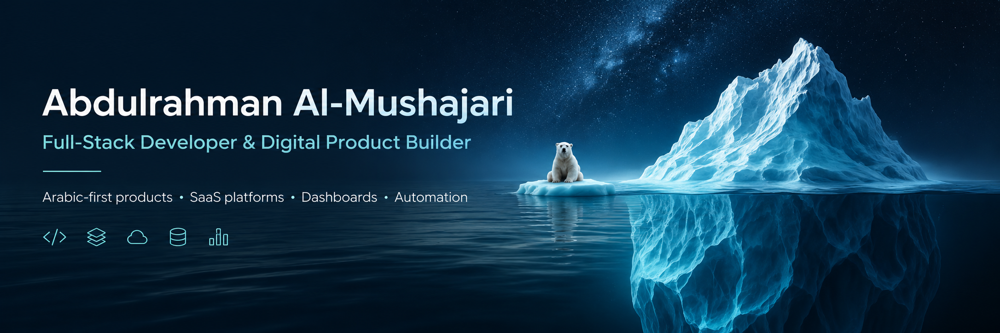

  

<h1 align="center">Abdulrahman Al-Mushajari</h1>

  <strong>Full-Stack Developer & Digital Product Builder</strong> 
  Building practical web platforms, dashboards, SaaS products, and Arabic-first digital experiences.

  أبني منتجات رقمية عملية، ولوحات تحكم، وتجارب عربية تدعم اتجاه RTL باحترافية.

> **Visual identity:** deep navy, glacier blue, icy aqua, and white — inspired by icebergs, polar seas, and the depth hidden beneath the surface.

  
  
  

## About

I turn operational and community problems into focused software products. My work includes business websites, administrative dashboards, SaaS platforms, marketplace experiences, automation workflows, and Arabic interfaces designed properly for right-to-left use.

I approach projects as products rather than isolated coding exercises: define the problem, design the user flow, build the system, document it clearly, and prepare it for real deployment.

## Core Expertise

- **Frontend:** responsive interfaces, design systems, dashboards, accessibility, and Arabic RTL UX
- **Backend:** API design, authentication, business logic, data validation, and third-party integrations
- **Products:** SaaS platforms, operational systems, PWAs, marketplaces, and business websites
- **Infrastructure:** Linux deployment, Nginx, PM2, Vercel, Render, and production environment configuration

  
  
  
  
  
  
  
  
  
  
  
  

## Selected Projects

| Project | Value | Status | Links |
|---|---|---|---|
| **Al-Zandani Car Dealership** | Arabic vehicle dealership experience with inventory presentation, filtering, vehicle details, WhatsApp contact, and administrative management. | Portfolio project · code not public | [View portfolio](https://portofile001.netlify.app/) |
| **Vitamin C Editorial Blog** | Responsive editorial blog focused on readable long-form content, structured navigation, sources, and polished interaction design. | Portfolio project · code not public | [View portfolio](https://portofile001.netlify.app/) |
| **Mowasalatna** | Regional route and trip-status platform built to help passengers view current transport information. It is a status platform, not a booking system. | Active product · code not public | [Open platform](https://mowasalatna.com/mowasalat) |
| **[Q-Search](https://github.com/abdulrahman-517/q-search)** | Arabic-first YouTube search interface that re-ranks results using a documented quality-scoring heuristic. | Public repository · live demo | [Repository](https://github.com/abdulrahman-517/q-search) · [Demo](https://q-search-77si.onrender.com) |
| **Aqarnapro** | Multi-office real-estate SaaS concept covering property management, administration, and office deployment workflows. | In development · code not public | [View portfolio](https://portofile001.netlify.app/) |
| **Haraj Al-Dhad** | Local Arabic marketplace concept for buying and selling within Al-Dhalea and nearby areas. | In development · code not public | [View portfolio](https://portofile001.netlify.app/) |

> Private-source projects are presented as product work only. Features described as in development are not presented as completed.

## Current Focus

- Building business management platforms and reusable SaaS foundations
- Improving Arabic RTL product experiences across desktop and mobile
- Designing practical dashboards and operational workflows
- Strengthening deployment, documentation, security, and maintainability

## GitHub Activity

  
  

Language statistics reflect public GitHub repositories only and are not a complete measure of experience.

## Contact

- **Portfolio:** [portofile001.netlify.app](https://portofile001.netlify.app/)
- **Email:** [abdulrahmanalmushajari@gmail.com](mailto:abdulrahmanalmushajari@gmail.com)
- **GitHub:** [@abdulrahman-517](https://github.com/abdulrahman-517)
- **Location:** Yemen

  <strong>Available for focused freelance projects, product collaborations, and technical partnerships.</strong>

