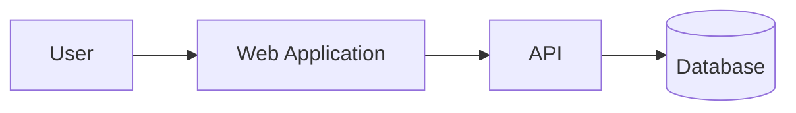

# Project Name

> One sentence explaining who the project serves, the problem it solves, and the principal outcome.

<p>
  <a href="VERIFIED_DEMO_URL">Live Demo</a> ·
  <a href="./docs/architecture.md">Architecture</a> ·
  <a href="./docs/deployment.md">Deployment</a>
</p>

## Status

**Current status:** Active / In development / Maintenance / Archived

Clearly separate completed functionality from planned work.

## Overview

Explain the project in five to eight lines. Cover the user, the business or operational problem, the product approach, and the present scope.

## Problem

Describe the real problem. Avoid generic phrases such as “modern solution” or “powerful platform.”

## Main Capabilities

- Implemented capability
- Implemented capability
- Implemented capability

### Planned

- [ ] Planned capability
- [ ] Planned capability

## User Roles

| Role | Access |
|---|---|
| Visitor | Public functionality |
| User | Authenticated functionality |
| Administrator | Management functionality |

Remove this section when roles do not apply.

## Technology Stack

| Layer | Technology |
|---|---|
| Frontend | |
| Backend | |
| Database | |
| Authentication | |
| Deployment | |

List only technologies used by the repository.

## Screenshots

<p align="center">
  
</p>

Do not add missing, stretched, private, or low-resolution screenshots.

## Architecture



Replace with the actual system flow.

## Project Structure

```text
project/
├── src/
├── public/
├── docs/
├── .env.example
├── .gitignore
└── README.md
```

## Local Development

### Prerequisites

- Runtime and exact supported version
- Package manager
- Required external services

### Installation

```bash
git clone REPOSITORY_URL
cd REPOSITORY_NAME
PACKAGE_MANAGER_INSTALL_COMMAND
```

### Environment variables

```bash
cp .env.example .env.local
```

| Variable | Required | Purpose |
|---|---:|---|
| `EXAMPLE_VARIABLE` | Yes | Description without a real value |

### Development

```bash
DEVELOPMENT_COMMAND
```

### Validation

```bash
LINT_COMMAND
BUILD_COMMAND
TEST_COMMAND
```

Include only commands verified against the repository.

## Deployment

Document the supported deployment target and required configuration without exposing production infrastructure, credentials, IP addresses, or private paths.

## Security

- Never commit real environment variables.
- Restrict third-party credentials.
- Validate authorization server-side.
- Do not expose internal errors.
- Report vulnerabilities privately.

## Known Limitations

- Current limitation
- Current limitation

## Roadmap

- [ ] Planned, credible improvement
- [ ] Planned, credible improvement

## License

State the actual license. Do not claim MIT unless a valid `LICENSE` file exists.

## Ownership and Contact

Built and maintained by [Abdulrahman Al-Mushajari](https://github.com/abdulrahman-517).

Professional inquiries: [abdulrahmanalmushajari@gmail.com](mailto:abdulrahmanalmushajari@gmail.com)
